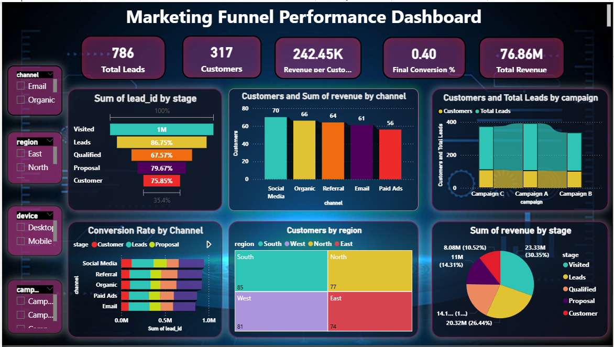
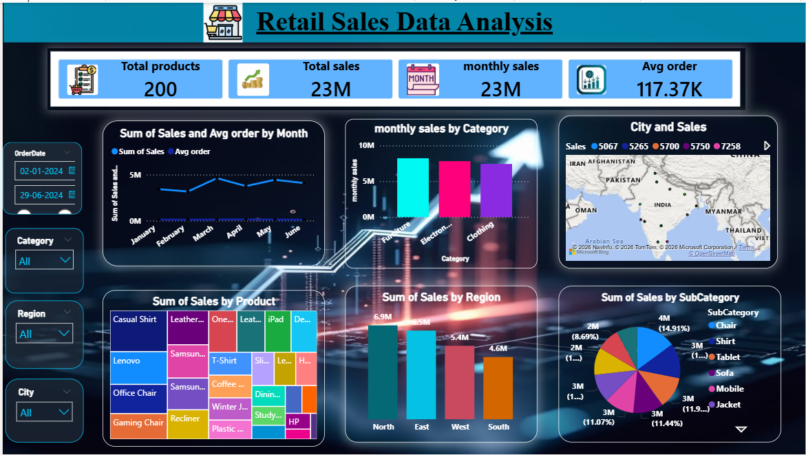

# 📊 Business Data Analytics Dashboards (Power BI)

## 👩‍💻 Author

**Seema Bhat**
Aspiring Data Analyst | Power BI Developer

---

## 🚀 About This Project

This repository presents a collection of **three end-to-end Power BI dashboards** designed to solve real-world business problems using data analytics and visualization.

The dashboards focus on:

* 📉 Customer Retention (Churn Analysis)
* 📈 Marketing Performance (Funnel Analysis)
* 🛒 Sales Optimization (Retail Analysis)

Each project demonstrates strong skills in **data cleaning, KPI creation, and business storytelling**.

---

## 📂 Repository Structure

```id="2i6g5y"
FUTURE_DS_01/
│
├── Task_01
│
├── Task_02
│
├── Task_03
```

---

# 📊 Customer Churn Dashboard

## 📸 Preview


## 🎯 Goal

To identify customer segments with high churn risk and understand the reasons behind customer attrition.

## 🔍 Highlights

* High churn in **month-to-month contracts**
* **New customers (low tenure)** are more likely to leave
* Service and payment methods impact retention

---

# 📈 Marketing Funnel Dashboard

## 📸 Preview



## 🎯 Goal

To analyze the customer journey across funnel stages and improve conversion rates.

## 🔍 Highlights

* Noticeable **drop-offs at each stage**
* **Social media channels** drive better conversions
* Campaign effectiveness varies significantly

---

# 🛒 Retail Sales Dashboard

## 📸 Preview



## 🎯 Goal

To evaluate sales performance across products, regions, and time.

## 🔍 Highlights

* Strong performance in **top regions**
* Revenue driven by **key product categories**
* Sales trends fluctuate over time

---

## 📊 Core Features

* Interactive dashboards with slicers
* KPI-focused design
* Clean and modern UI
* Business-driven insights

---

## 🛠️ Tools & Skills Demonstrated

* Power BI
* DAX (Data Analysis Expressions)
* Data Modeling
* Data Cleaning & Transformation
* Dashboard Design

---

## 📈 What This Project Shows

* Ability to convert raw data into insights
* Strong understanding of business KPIs
* Hands-on experience with Power BI dashboards
* Data storytelling and visualization skills

---

## 📌 Final Note

This project reflects practical implementation of data analytics concepts and demonstrates readiness for real-world business analysis roles.

---
