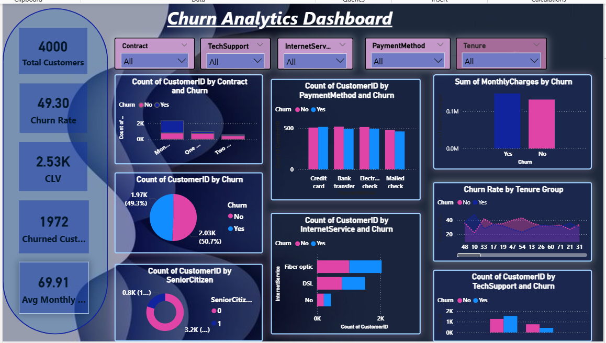

📊 Customer Churn Analytics Dashboard

🚀 Project Overview

This dashboard analyzes customer churn behavior to help businesses understand why customers leave and how to improve retention strategies.

👩‍💻 Author

Seema Bhat
Aspiring Data Analyst | Power BI Developer

🎯 Business Objective

* Identify factors contributing to customer churn
* Analyze customer behavior patterns
* Improve customer retention strategies
* Reduce revenue loss

📂 Dataset Description

The dataset includes:

* Customer ID
* Contract Type
* Internet Service
* Payment Method
* Tenure
* Monthly Charges
* Churn Status

📊 Key KPIs

* 👥 Total Customers: 4000
* 📉 Churn Rate: 49.30%
* ❌ Churned Customers: 1972
* 💰 CLV: 2.53K
* 💳 Avg Monthly Charges: 69.91

📸 Dashboard Preview

📈 Key Insights

* Month-to-month contract customers churn more
* Fiber users have higher churn
* Low tenure customers are at high risk
* Payment method impacts churn behavior

📊 Visualizations Used

* Bar Chart → Contract vs Churn
* Pie Chart → Churn Distribution
* Line Chart → Tenure Analysis
* KPI Cards & Slicers

🛠️ Tools Used

* Power BI
* DAX
* Data Cleaning

📌 Conclusion

Helps identify churn drivers and improve retention strategies.

